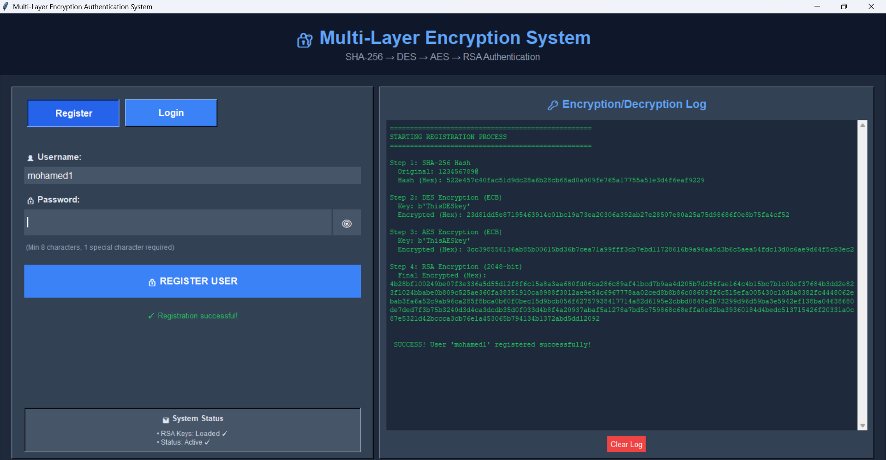
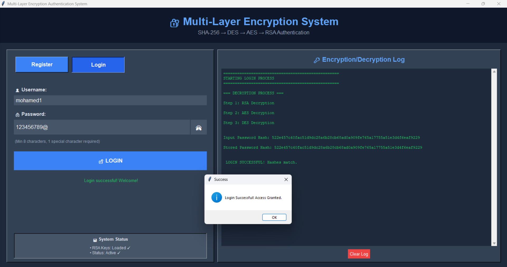

# 🔐 Multi-Layer Encryption Authentication System


A Python-based graphical authentication system designed to visualize and demonstrate the concept of **Multi-Layer Encryption**. This project implements a hybrid cryptographic approach combining Hashing, Symmetric, and Asymmetric encryption to secure user credentials.

---

## 🚀 Overview

This application serves as an educational tool for understanding how different cryptographic algorithms can be chained together. It features a live "Encryption Log" that shows the transformation of data in real-time during the registration and login processes.

### The Encryption Chain:

1. **Hashing:** Input password is hashed using **SHA-256**.
2. **Symmetric Layer 1:** The hash is encrypted using **DES** (Data Encryption Standard) in ECB mode.
3. **Symmetric Layer 2:** The DES output is re-encrypted using **AES** (Advanced Encryption Standard).
4. **Asymmetric Layer:** The final result is encrypted using **RSA** (2048-bit).

---

## 📸 Screenshots

### Registration Interface

*Real-time visualization of the encryption process*

### Login with Decryption Log

*Step-by-step decryption verification*

---

## 🛠️ Features

* **Interactive GUI:** Built with **Tkinter**, offering a clean dark-mode interface with toggleable password visibility.
* **Real-time Logging:** A side panel that displays the hexadecimal output of each encryption step (SHA → DES → AES → RSA).
* **Key Management:** Automatically generates and loads RSA 2048-bit key pairs (`rsa_keys.pem`) and ensures necessary files exist.
* **Password Validation:** Enforces minimum 8 characters with at least one special character.
* **Login Security:** Limits failed login attempts (3 max) with system lockout protection.
* **Modular Architecture:** Clean code structure separating GUI, Logic, Cryptography, and File Management.

---

## 📋 Requirements

- **Python 3.7+**
- **tkinter** (usually included with Python)
- **pycryptodome** (for cryptographic operations)

---

## 📂 Project Structure

```
├── main.py                # GUI implementation with Tkinter
│                          # Handles user interactions and display
├── auth_service.py        # Core authentication logic
│                          # Manages registration and login workflows
├── crypto_operations.py   # Cryptographic implementations
│                          # SHA-256, DES, AES, RSA operations
├── file_manager.py        # File I/O operations
│                          # User database and RSA key management
├── validation.py          # Input validation utilities
│                          # Password strength verification
├── users_data.txt         # (Auto-generated) User credentials storage
└── rsa_keys.pem           # (Auto-generated) RSA key pairs
```

---

## ⚙️ Installation & Usage

### 1. Clone the repository:
```bash
git clone https://github.com/MoAhmed2004/Multi-Layer_Encryption_Authentication_System.git
cd Multi-Layer_Encryption_Authentication_System
```

### 2. Install dependencies:
```bash
pip install -r requirements.txt
```

### 3. Run the application:
```bash
python main.py
```

---

## 💡 Usage Example

### Registration:
1. Select **"Register"** mode
2. Enter username: `mohamed`
3. Enter password: `SecureP@ss123!`
4. Click **"🔒 REGISTER USER"**
5. Watch the encryption process in the log panel

### Login:
1. Switch to **"Login"** mode
2. Enter your registered credentials
3. Click **"🔓 LOGIN"**
4. Observe the decryption chain validation

---

## 🛡️ Security Considerations

**⚠️ Educational Purpose Only:** This project demonstrates cryptographic concepts and is not intended for production use.

| Current Implementation | Production Recommendation |
|------------------------|---------------------------|
| ECB Mode (DES/AES) | CTR with IV |
| Hardcoded Symmetric Keys | Environment Variables / KMS |
| SHA-256 only | Argon2 / Bcrypt with unique Salt |
| Flat File Storage | Encrypted SQL Database |
| 3 Login Attempts | Rate Limiting + CAPTCHA |

### Known Limitations:
- ECB mode lacks diffusion (pattern preservation)
- No salt for password hashing (vulnerable to rainbow tables)
- Plaintext keys in source code
- No session management or token-based auth
- Single-threaded GUI (blocking operations)

---

## 🔮 Future Work

The following enhancements are planned to improve security and production readiness:

### 1️⃣ Replace ECB with CTR mode
Migrate from Electronic Codebook (ECB) to Counter (CTR) mode to eliminate pattern preservation vulnerabilities and provide proper diffusion in encrypted data.

### 2️⃣ Remove DES and rely on AES only
Eliminate the deprecated DES algorithm and use AES-256 exclusively, as DES is vulnerable to brute-force attacks and no longer meets modern security standards.

### 3️⃣ Implement password salting
Add unique, randomly-generated salts for each password before hashing using PBKDF2 or Argon2 to prevent rainbow table attacks and enhance password security.

### 4️⃣ Use database instead of text files
Migrate from flat-file storage to a secure SQL database (PostgreSQL/SQLite) with proper encryption at rest, prepared statements, and transaction support.

### 5️⃣ Implement a "forget password" feature
Add secure password recovery mechanism using email verification, time-limited reset tokens (15-30 minutes expiration), and rate limiting to prevent abuse.

---

### Additional Enhancements
- [ ] Add comprehensive unit tests with pytest
- [ ] Implement multi-factor authentication (MFA/TOTP)
- [ ] Add session management with JWT tokens
- [ ] Implement proper logging framework (structured logs)
- [ ] Add rate limiting on authentication attempts
- [ ] Integrate with Key Management Systems (KMS)

---

## 🤝 Contributing

Contributions are welcome! Feel free to:
- 🐛 Report bugs
- 💡 Suggest new features
- 🔧 Submit pull requests

---

## 👨‍💻 Authors

### **Mohamed Ahmed**
🔐 Cybersecurity Student  
[](https://www.linkedin.com/in/mohamedahmed2004)
[](https://github.com/MoAhmed2004)

### **Hana Emad**
🔐 Cybersecurity Student  
[](https://www.linkedin.com/in/hana-emad-ba7066314/)
[](https://github.com/hana200000)

---

## 🙏 Acknowledgments 

- **PyCryptodome** for cryptographic primitives
- **Tkinter** for GUI framework
- Educational resources on hybrid cryptography

---

⭐ If you found this project helpful, please consider giving it a star!
